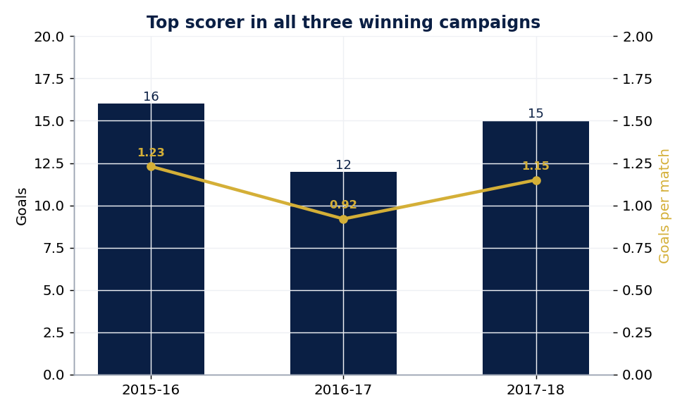
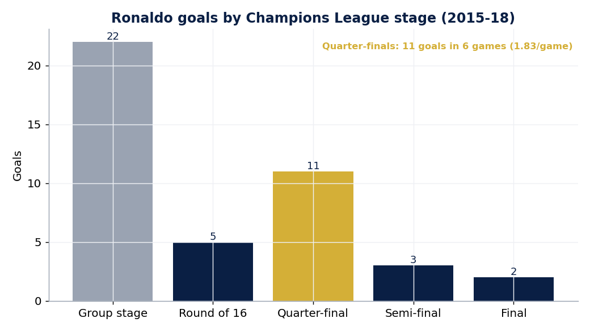
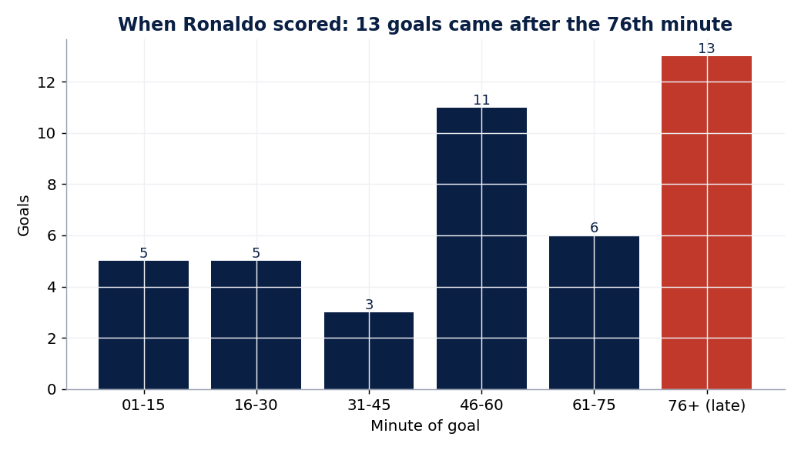
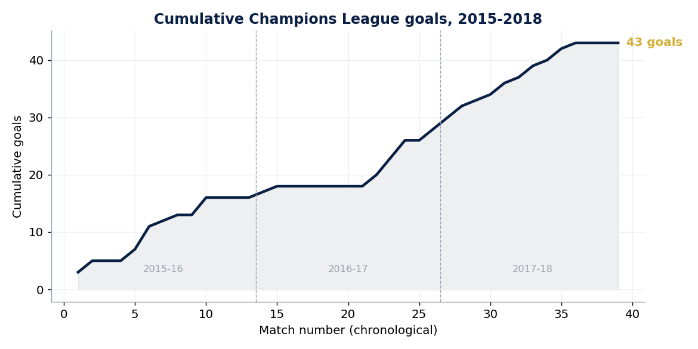
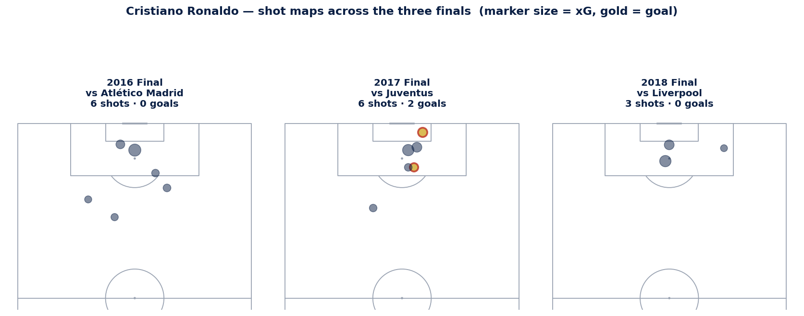
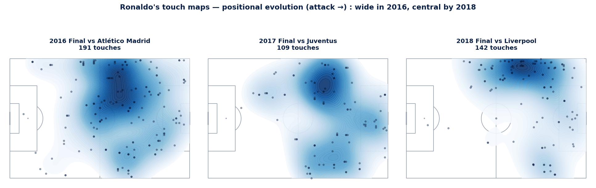

# Cristiano Ronaldo — Mr. Champions League (2015–2018) ⚽👑

A football-analytics deep dive into Cristiano Ronaldo's role in **Real Madrid's
Champions League three-peat** (2015–16, 2016–17, 2017–18 — *La Undécima, La Duodécima,
La Decimotercera*). The goal: use data to show **why he earned the "Mr. Champions League"
reputation**, and how clutch he was in the knockout rounds and finals.

> **Headline:** 43 goals in 39 matches across three consecutive winning campaigns —
> **top scorer in all three** — with **11 goals in just 6 quarter-finals** and
> **13 goals scored after the 76th minute.**

This project combines two free, public data sources and a small SQL + Python pipeline.
All numbers are reproducible by running one command, and the campaign goal totals are
**validated against Ronaldo's official tallies** (16 / 12 / 15) before any chart is drawn.

---

## What the data says

### 1. Top scorer in all three winning campaigns


### 2. The clutch case — quarter-final dominance
He saved his best for the business end: **1.83 goals per game in the quarter-finals**,
his most prolific round.


### 3. A late-game killer
The single most common moment for a Ronaldo Champions League goal in this era was
**the final 15 minutes** — 13 of his 43 goals came in the 76th minute or later.


### 4. 43 goals, three seasons


### 5. The finals, in detail (event-level data)
Shot maps for the three finals (marker size = expected goals, gold = goal). Note the
2016 final shows open-play/extra-time shots only — Ronaldo also scored the **winning
penalty in the shootout** to clinch *La Undécima*.


His touch maps reveal a tactical evolution — **wider on the left in 2016, increasingly
central by 2018** as he became a pure penalty-box finisher.


---

## How it works

```
openfootball (match results)  ─┐
                               ├─►  build_dataset.py  ─►  ronaldo_ucl_campaign.csv
Wikipedia (goalscorers)       ─┘        │ (validated vs official totals)
                                        ▼
                              analyze_sql.py  (DuckDB SQL)  ─►  q_*.csv
                                        ▼
                  viz_campaign.py  +  viz_finals.py (StatsBomb + mplsoccer)  ─►  outputs/*.png
```

- **Match skeleton** (every Real Madrid CL match, group stage → final, with stage,
  opponent and score) comes from [**openfootball**](https://github.com/openfootball) —
  this is also what makes the dataset *Champions League only* (no La Liga, Copa, etc.).
- **Ronaldo's goals + goal minutes** are parsed from **Wikipedia** match boxes.
- **Event-level finals data** (shots, xG, touches with pitch coordinates) comes from
  [**StatsBomb open data**](https://github.com/statsbomb/open-data).
- **SQL** runs on the local CSV via **DuckDB**; charts use **matplotlib** + **mplsoccer**.

See [`SOURCES.md`](SOURCES.md) for full data provenance.

## Run it yourself

```bash
pip install -r requirements.txt
python run_all.py
```

That regenerates the dataset, the SQL tables (`data/processed/`) and every chart
(`outputs/`). First run downloads + caches the source data; later runs are offline.

## Project structure

```
ronaldo-ucl-2016-2018/
├── run_all.py              # one command runs the whole pipeline
├── src/
│   ├── common.py           # paths, season config, Wikipedia/wikitext helpers
│   ├── build_dataset.py    # fetch + parse + join + validate -> campaign CSV
│   ├── analyze_sql.py      # DuckDB SQL aggregations
│   ├── viz_campaign.py     # matplotlib campaign charts
│   └── viz_finals.py       # StatsBomb + mplsoccer finals visuals
├── data/
│   ├── raw/                # cached downloads (openfootball, Wikipedia)
│   └── processed/          # ronaldo_ucl_campaign.csv + query outputs
└── outputs/                # generated charts (PNG)
```

## Caveats (because honesty matters in analytics)
- Free **event-level** data exists only for the three **finals**; the group/knockout
  analysis is at match level (goals, minutes), not shot-by-shot.
- Goal attribution is parsed from Wikipedia and **cross-checked against official
  per-season totals** (16/12/15). Penalty-shootout goals are excluded from goal counts.

---
*Built as a personal football-analytics portfolio project. Data: openfootball, Wikipedia,
StatsBomb open data — all free and public.*
